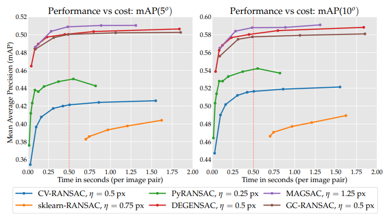
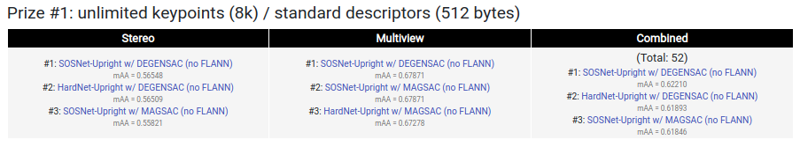

# Important news

I am happy to announce that MAGSAC++ had been included in OpenCV.
You can check the documentation at [link](https://docs.opencv.org/4.5.2/d1/df1/md__build_master-contrib_docs-lin64_opencv_doc_tutorials_calib3d_usac.html).
A comparison of OpenCV MAGSAC++ with the other robust estimators is at [link](https://opencv.org/evaluating-opencvs-new-ransacs/) thanks to Dmytro Mishkin. 


# The MAGSAC and MAGSAC++ algorithms for robust model fitting without using a single inlier-outlier threshold

The MAGSAC and MAGSAC++ algorithms proposed for robust model estimation without a single inlier-outlier threshold.

The MAGSAC paper is available at [Link](https://openaccess.thecvf.com/content_CVPR_2019/html/Barath_MAGSAC_Marginalizing_Sample_Consensus_CVPR_2019_paper.html).

The MAGSAC++ available at [Link](https://openaccess.thecvf.com/content_CVPR_2020/papers/Barath_MAGSAC_a_Fast_Reliable_and_Accurate_Robust_Estimator_CVPR_2020_paper.pdf).

Both methods are explained in the [Latest developments in RANSAC presentation](https://www.youtube.com/watch?v=Nfd9dzeSSG8&feature=youtu.be) from CVPR tutorial [RANSAC in 2020](http://cmp.felk.cvut.cz/cvpr2020-ransac-tutorial/).

Experiments on homography, fundamental matrix, essential matrix, and 6D pose estimation are shown in the corresponding [presentation](https://www.youtube.com/watch?v=igRydL72160&feature=youtu.be) from the tutorial RANSAC in 2020.

Tested on OpenCV 3.46 and 4.3.
To run the executable with the examples, copy the "data" folder next to the executable or set the path in the main() function.


If you use the algorithm, please cite

```
@inproceedings{barath2019magsac,
	author = {Barath, Daniel and Matas, Jiri and Noskova, Jana},
	title = {{MAGSAC}: marginalizing sample consensus},
	booktitle = {Conference on Computer Vision and Pattern Recognition},
	year = {2019},
}

@inproceedings{barath2019magsacplusplus,
	author = {Barath, Daniel and Noskova, Jana and Ivashechkin, Maksym and Matas, Jiri},
	title = {{MAGSAC}++, a fast, reliable and accurate robust estimator},
	booktitle = {Conference on Computer Vision and Pattern Recognition},
	year = {2020},
}

```

# Installation C++

To build and install C++-only `MAGSAC`/`MAGSAC++`, clone or download this repository and then build the project by CMAKE. 
```shell
$ git clone https://github.com/danini/magsac --recursive
$ cd build
$ cmake ..
$ make
```

# Install Python package and compile C++

```bash
python3 ./setup.py install
```

or

```bash
pip3 install -e .
```

# Example project

To build the sample project showing examples of fundamental matrix, homography and essential matrix fitting, set variable `CREATE_SAMPLE_PROJECT = ON` when creating the project in CMAKE. 

Next to the executable, copy the `data` folder and, also, create a `results` folder. 

# Jupyter Notebook example

The example for homography fitting is available at: [notebook](examples/example_homography.ipynb).

The example for fundamental matrix fitting is available at: [notebook](examples/example_fundamental_matrix.ipynb).

The example for essential matrix fitting is available at: [notebook](examples/example_essential_matrix.ipynb).

# Requirements

- Eigen 3.0 or higher
- CMake 2.8.12 or higher
- OpenCV 3.0 or higher
- A modern compiler with C++17 support
- GFlags
- GLOG

# Performance of MAGSAC++

MAGSAC++ is the state of the art according to "RANSAC in 2020" CVPR tutorial's [experiments](http://cmp.felk.cvut.cz/cvpr2020-ransac-tutorial/presentations/RANSAC-CVPR20-Mishkin.pdf).

# Performance of MAGSAC

MAGSAC is the state of the art according to the recent study Yin et.al."[Image Matching across Wide Baselines: From Paper to Practice](https://arxiv.org/abs/2003.01587.pdf)", 2020.





